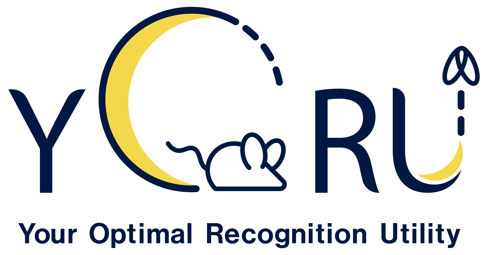

# YORU (Your Optimal Recognition Utility)




“YORU” (Your Optimal Recognition Utility) is an open-source animal behavior recognition system using Python. YORU can detect animal behaviors, not only single-animal behaviors but also social behaviors. YORU also provides online/offline analysis and closed-loop manipulation.

## Versions

| Channel | Version | Notes |
|---------|---------|-------|
| **Latest Release** | [v1.1.1](https://github.com/Kamikouchi-lab/YORU/releases/tag/v1.1.1) | Stable release recommended for general use |
| **Latest Beta** | [v2.0.0-beta.1](https://github.com/Kamikouchi-lab/YORU/releases/tag/v2.0.0-beta.1) | Preview of the next major version — may contain bugs |

> To use the beta version, check out the corresponding tag:
> ```
> git checkout v2.0.0-beta.1
> ```

## Features

- Comprehensive Behavior Detection: Recognizes both single-animal and social behaviors, and allows for user-defined animal appearances using deep learning techniques.

- Online/Offline Analysis: Supports real-time and post-experiment data analysis.

- Closed-Loop Manipulation: Enables interactive experiments with live feedback control.

- User-Friendly Interface: Provide the GUI-based software.

- Customizable: Allows you to customize various hardware manipulations in closed-loop system.

# Quick install

Follow these steps to install YORU quickly:

1. Download or clone the YORU project.
    ```
    cd "Path/to/download"
    git clone https://github.com/Kamikouchi-lab/YORU.git 
    ```

2. Install the appropriate GPU driver and the [CUDA toolkit](https://developer.nvidia.com/cuda-toolkit).

3. Create a virtual environment.

    Use [YORU.yml](https://github.com/Kamikouchi-lab/YORU/blob/main/YORU.yml) file to create a conda environment:
   
     ```
     conda env create -f "Path/to/YORU.yml"
     ```

4. Activate the virtual environment in the command prompt or Anaconda prompt.

     ```
     conda activate yoru
     ```
    
5. Install [Pytorch](https://pytorch.org) corresponding to the CUDA versions.

    - For CUDA==11.8

    ```
    pip install torch==2.4.1 torchvision==0.19.1 torchaudio==2.4.1 --index-url https://download.pytorch.org/whl/cu118
    ```

   - For CUDA==12.1

    ```
    pip install torch==2.4.1 torchvision==0.19.1 torchaudio==2.4.1 --index-url https://download.pytorch.org/whl/cu121
    ```
    

    - (torch, torchvision and torchaudio will be installed.)

6. Run YORU in the command prompt or Anaconda prompt.

    Navigate to the YORU project folder and execute:

    ```
    conda activate yoru
    cd "Path/to/YORU/project/folder"
    python -m yoru
    ```

7. etc.

    To check CUDA version in your environment:
    ```
    nvidia-smi
    ```
## Install via uv
Although not all functionality has been tested, installation via uv can be performed using the project.toml file below.
[project.toml](https://github.com/Kamikouchi-lab/YORU/blob/uv_install/pyproject.toml)

copy and paste this file to your YORU folder and

```
cd "Path/to/YORU"
uv init .
uv sync
python -m yoru
```

# Learn about YORU
- [User guides](https://kamikouchi-lab.github.io/YORU_doc/guides/01-install/)

- [Step-by-step Tutorial](https://kamikouchi-lab.github.io/YORU_doc/tutorial/01-preparation-tutorial/)

- [Testing Guide](https://kamikouchi-lab.github.io/YORU_doc/devnotes/yoru-test/)

# Requirements

## OS
- Windows 10 or later

## Hardware
- Memory: 16 GB RAM or more
- GPU: NVIDIA GPU compatible with the required CUDA version

### Development environments
- OS: Windows 11
- CPU: Intel Core i9 (11th)
- GPU: NVIDIA RTX 3080
- Memory: DDR4 32 GB

# Reference
 - Yamanouchi, H. M., Takeuchi, R. F., Chiba, N., Hashimoto, K., Shimizu, T., Osakada, F., Tanaka, R., & Kamikouchi, A. (2026). YORU: Animal behavior detection with object-based approach for real-time closed-loop feedback. *Science Advances*, 12(7). https://doi.org/10.1126/sciadv.adw2109


# License:

AGPL-3.0 License:  YORU is intended for research/academic/personal use only. See the [LICENSE](LICENSE) file for more details.

# Third-Party Libraries and Licenses

This project includes code from the following repositories:

- [LabelImg](https://github.com/HumanSignal/labelImg): Licensed under the MIT License

- [yolov5](https://github.com/ultralytics/yolov5): Licensed under the AGPL-3.0 License

