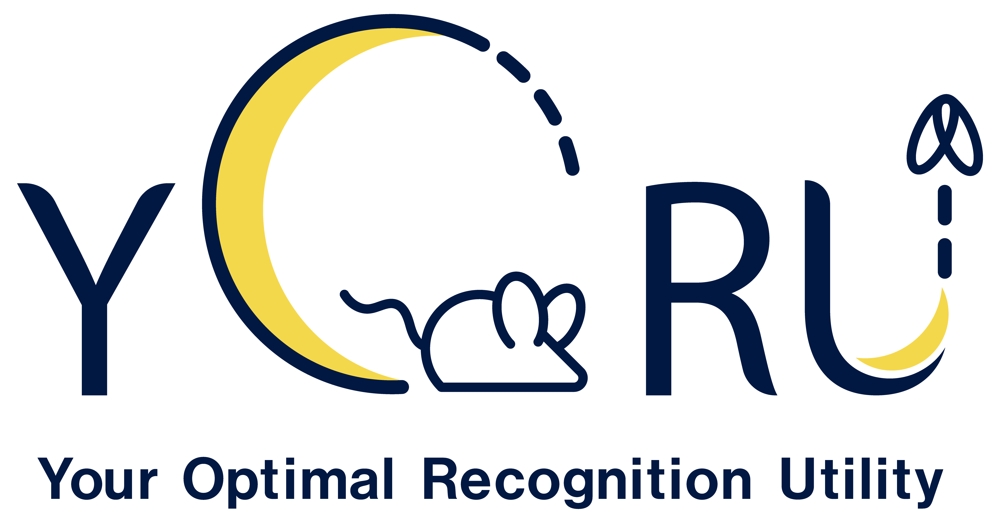

# YORU (Your Optimal Recognition Utility)




[](https://github.com/Kamikouchi-lab/YORU/releases/latest)
[](https://github.com/Kamikouchi-lab/YORU/releases)
[](https://www.gnu.org/licenses/agpl-3.0)
[](https://kamikouchi-lab.github.io/YORU_doc/)
[](https://github.com/sponsors/HMYamano)
[](https://github.com/Kamikouchi-lab/YORU)
[](https://github.com/Kamikouchi-lab/YORU/issues)

“YORU” (Your Optimal Recognition Utility) is an open-source animal behavior recognition system using Python. YORU can detect animal behaviors, not only single-animal behaviors but also social behaviors. YORU also provides online/offline analysis and closed-loop manipulation.

## Versions

| Channel | Version | Notes |
|---------|---------|-------|
| **Latest Release** | [v1.1.1](https://github.com/Kamikouchi-lab/YORU/releases/tag/v1.1.1) | Stable release recommended for general use |
| **Latest Beta** | [v2.0.0-beta.2](https://github.com/Kamikouchi-lab/YORU/releases/tag/v2.0.0-beta.2) | Preview of the next major version — may contain bugs |

> To use the beta version, check out the corresponding tag:
> ```
> git checkout v2.0.0-beta.2
> ```

## Features

- Comprehensive Behavior Detection: Recognizes both single-animal and social behaviors, and allows for user-defined animal appearances using deep learning techniques.

- Online/Offline Analysis: Supports real-time and post-experiment data analysis.

- Closed-Loop Manipulation: Enables interactive experiments with live feedback control.

- User-Friendly Interface: Provide the GUI-based software.

- Customizable: Allows you to customize various hardware manipulations in closed-loop system.

# Prerequisites

Neither conda nor uv can install these for you, and two of them are needed on
every platform.

## A Chromium browser

The launcher window is a web page served by
[Eel](https://github.com/python-eel/Eel), which opens it in **Google Chrome or
Chromium**. YORU uses Eel's default `chrome` mode, so the browser has to be
findable:

| OS | Where Eel looks for it |
|----|------------------------|
| Windows | the `App Paths\chrome.exe` registry key |
| macOS | `/Applications/Google Chrome.app`, then `Chromium.app`, then `mdfind` |
| Linux | `chromium-browser`, `chromium`, `google-chrome` or `google-chrome-stable` on `PATH` |

Without one, the launcher stops with `EnvironmentError: Can't find Google
Chrome/Chromium installation`. Microsoft Edge is Chromium-based, but it
registers as `msedge.exe` and is not picked up; Safari is not supported by Eel
either. Only the launcher needs a browser -- training, detection, evaluation
and analysis each open their own native window.

## An NVIDIA driver, to use a GPU (Windows / Linux)

The driver is the only system-level piece YORU needs for CUDA, on both the uv
and the conda route. The PyTorch wheels ship their own CUDA runtime -- `cudart`,
cuBLAS and cuDNN live inside the installed `torch` package -- so **the
[CUDA toolkit](https://developer.nvidia.com/cuda-toolkit) does not have to be
installed at all**. Install it only if you need `nvcc` to compile CUDA
extensions of your own, or want the profilers. The driver has to support CUDA
12.x: 527.41 or newer on Windows, 525.60.13 or newer on Linux. Check what you
have with:

```
nvidia-smi
```

The `CUDA Version` that `nvidia-smi` prints is the highest your driver can
serve, not the version YORU uses -- a driver reporting 13.x runs the CUDA 12.4
wheels fine.

With no usable GPU, YORU falls back to the CPU, which is much slower but
otherwise works.

## macOS: Apple Silicon, and the Command Line Tools

YORU targets macOS 14 (Sonoma) or later on Apple Silicon. Intel Macs are not
supported: the macOS wheels of the PyTorch and Qt versions YORU pins are arm64
only.

Two dependencies (`imgui` and `gevent`) publish no arm64 wheels, so `uv sync`
compiles them. Install the Command Line Tools first, or the sync fails:

```
xcode-select --install
```

The first time you use a camera, the key-press triggers (`pynput`) or screen
capture (`mss`), macOS asks for **Camera**, **Input Monitoring** /
**Accessibility** and **Screen Recording** permission. The prompts are aimed at
the terminal application you launched YORU from; grant them in *System Settings
> Privacy & Security* and relaunch.

# Quick install (conda)

Follow these steps to install YORU quickly:

> These steps describe the conda route, which targets Windows (and Linux) with an NVIDIA GPU.
> On macOS, or if you already use [uv](https://docs.astral.sh/uv/), [Install via uv](#install-via-uv) below is simpler.

1. Download or clone the YORU project.
    ```
    cd "Path/to/download"
    git clone https://github.com/Kamikouchi-lab/YORU.git 
    ```

2. Install the appropriate GPU driver (see
   [Prerequisites](#an-nvidia-driver-to-use-a-gpu-windows--linux)). The CUDA
   toolkit is not needed here either: the PyTorch wheels in step 5 bring their
   own CUDA runtime. What the `cu118` / `cu121` choice there has to match is
   your **driver**, not an installed toolkit.

3. Create a virtual environment.

    Use [YORU.yml](https://github.com/Kamikouchi-lab/YORU/blob/main/YORU.yml) file to create a conda environment:
   
     ```
     conda env create -f "Path/to/YORU.yml"
     ```

    The environment file pins Python 3.10, which is the version YORU targets.

4. Activate the virtual environment in the command prompt or Anaconda prompt.

     ```
     conda activate yoru
     ```
    
5. Install [Pytorch](https://pytorch.org) corresponding to the CUDA versions.

    - For CUDA==11.8

    ```
    pip install torch==2.4.1 torchvision==0.19.1 torchaudio==2.4.1 --index-url https://download.pytorch.org/whl/cu118
    ```

   - For CUDA==12.1

    ```
    pip install torch==2.4.1 torchvision==0.19.1 torchaudio==2.4.1 --index-url https://download.pytorch.org/whl/cu121
    ```
    

    - (torch, torchvision and torchaudio will be installed.)

6. Run YORU in the command prompt or Anaconda prompt.

    Navigate to the YORU project folder and execute:

    ```
    conda activate yoru
    cd "Path/to/YORU/project/folder"
    python -m yoru
    ```

7. etc.

    To check CUDA version in your environment:
    ```
    nvidia-smi
    ```
# Install via uv

The repository ships its own `pyproject.toml` and `uv.lock`, so
[uv](https://docs.astral.sh/uv/) builds the whole environment in one step on
Windows, Linux and macOS. uv also picks the right PyTorch build for your
platform automatically: the CUDA wheels on Windows and Linux, and the
MPS-enabled build from PyPI on macOS. Neither a system Python nor conda is
needed -- uv downloads the Python 3.10 the project asks for.

1. Install uv.

    Windows (PowerShell):

    ```
    winget install --id=astral-sh.uv -e
    ```

    macOS / Linux:

    ```
    curl -LsSf https://astral.sh/uv/install.sh | sh
    ```

    `brew install uv` works on macOS too. Other options, including the
    standalone installers, are in the
    [uv installation guide](https://docs.astral.sh/uv/getting-started/installation/).
    Open a new terminal afterwards so that `uv` is on `PATH`.

2. Clone the repository and build the environment.

    ```
    git clone https://github.com/Kamikouchi-lab/YORU.git
    cd YORU
    uv sync
    ```

    The first sync downloads PyTorch and takes a few minutes. On macOS it also
    compiles two dependencies, which needs the Command Line Tools -- see
    [Prerequisites](#macos-apple-silicon-and-the-command-line-tools).

3. Run YORU **from the repository root**: the launcher resolves `web/` and
   `config/` relative to the working directory.

    ```
    uv run yoru
    ```

`uv run python -m yoru` does the same thing. There is no `uv init` step: the
project is already initialised, and uv refuses to re-initialise a folder that
already has a `pyproject.toml`.

To check that the environment picked up your GPU:

```
uv run python -c "import torch; print(torch.cuda.is_available())"
```

# Compute device

YORU picks its compute device automatically, in this order: CUDA, then Apple MPS, then CPU. Nothing has to be configured for the usual cases, beyond the NVIDIA driver CUDA needs (see [Prerequisites](#an-nvidia-driver-to-use-a-gpu-windows--linux)).

To choose the device yourself, set the `YORU_DEVICE` environment variable before launching (`cuda`, `mps`, `cpu`, or a CUDA index such as `0`), or use the device selector in the training GUI:

```
YORU_DEVICE=cpu uv run yoru
```

On Windows, `set YORU_DEVICE=cpu` before the launch command. The variable applies to YOLOv8, YOLO11, RT-DETR and the torchvision detectors; YOLOv5 inference is loaded through `torch.hub`, which always takes CUDA when it is available and the CPU otherwise. If the requested device is unavailable, YORU falls back to the next best one and writes a warning to `~/.yoru/logs/yoru.log` (`%USERPROFILE%\.yoru\logs\yoru.log` on Windows).

On Apple Silicon, MPS clearly helps training, but it is *not* faster than the CPU for single-frame realtime inference with the small YOLO models: we measured 60.8 FPS on MPS against 68.7 FPS on CPU for yolov8n at 640x480. For realtime detection on a Mac, `YORU_DEVICE=cpu` is worth trying.

The Faster R-CNN / Mask R-CNN / SSD models need torchvision 0.29 or newer to train on MPS at all; earlier releases diverge to an infinite loss within one epoch. The uv environment pins a new enough build, but the conda environment may not, so YORU checks the installed version and falls back to the CPU with a message when it is too old.

# Learn about YORU
- [User guides](https://kamikouchi-lab.github.io/YORU_doc/guides/01-install/)

- [Step-by-step Tutorial](https://kamikouchi-lab.github.io/YORU_doc/tutorial/01-preparation-tutorial/)

- [Testing Guide](https://kamikouchi-lab.github.io/YORU_doc/devnotes/yoru-test/)

# Requirements

## OS
- Windows 10 or later, with an NVIDIA GPU. This is the primary target, and the only platform tested end to end including the closed-loop hardware.
- Linux, with an NVIDIA GPU and CUDA. It uses the same CUDA wheels as Windows, but has seen much less testing.
- macOS 14 (Sonoma) or later, on Apple Silicon. The floor comes from PyTorch: torchvision 0.29 is the first release whose detection models train correctly on MPS, and it requires a torch build whose macOS wheels target 14.0.

## Hardware
- Memory: 16 GB RAM or more
- GPU: NVIDIA GPU with a driver supporting CUDA 12.x, or an Apple Silicon (M-series) Mac, which uses MPS. YORU also runs on the CPU alone, but detection is much slower.

### Development environments
- OS: Windows 11
- CPU: Intel Core i9 (11th)
- GPU: NVIDIA RTX 3080
- Memory: DDR4 32 GB

## Software
- Python 3.10. uv installs it for you; the conda environment file pins it.
- Google Chrome or Chromium, for the launcher window. See
  [Prerequisites](#a-chromium-browser).
- To use a GPU: an NVIDIA driver supporting CUDA 12.x on Windows/Linux, or
  macOS 14+ on Apple Silicon for MPS. The CUDA toolkit itself is optional.
- On macOS only: the Xcode Command Line Tools, and the Camera / Input
  Monitoring / Screen Recording permissions.

### Platform notes
- On macOS, training and inference are verified end to end, but the GUI has had far less testing there than on Windows.
- The closed-loop hardware manipulation depends on drivers we only use on Windows: NI-DAQ (via `nidaqmx`) needs the NI-DAQmx driver, and the Arduino path is untested elsewhere. Detection, training and analysis do not need any of it.

# Reference
 - Yamanouchi, H. M., Takeuchi, R. F., Chiba, N., Hashimoto, K., Shimizu, T., Osakada, F., Tanaka, R., & Kamikouchi, A. (2026). YORU: Animal behavior detection with object-based approach for real-time closed-loop feedback. *Science Advances*, 12(7). https://doi.org/10.1126/sciadv.adw2109


# License:

AGPL-3.0 License:  YORU is intended for research/academic/personal use only. See the [LICENSE](LICENSE) file for more details.

# Third-Party Libraries and Licenses

This project includes code from the following repositories:

- [LabelImg](https://github.com/HumanSignal/labelImg): Licensed under the MIT License

- [yolov5](https://github.com/ultralytics/yolov5): Licensed under the AGPL-3.0 License

