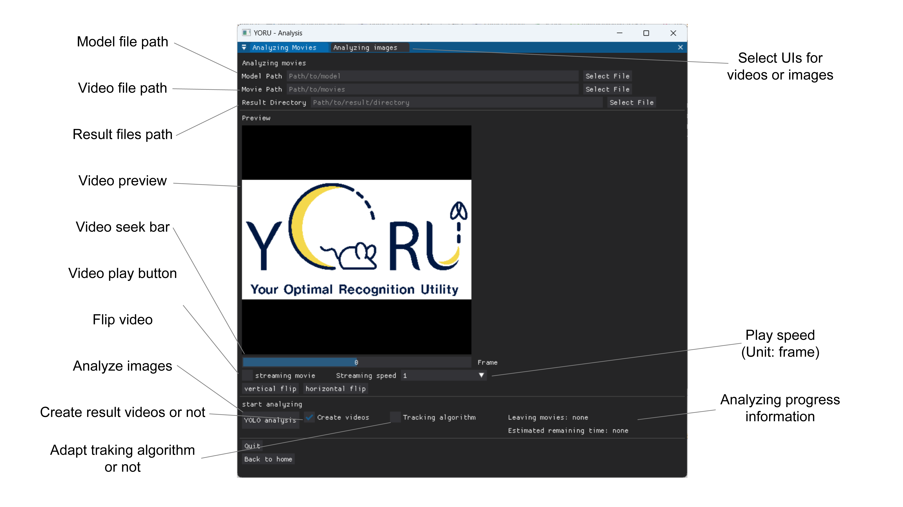

# Analyze videos (offline)

1. Select a model to analyze videos.

2. Select movies.

3. Select a folder to save results.

4. Check the previews.
    
    > When a video is loaded, the first video appears in PREVIEW.

    > Check for flips, etc., and adjust vertical and horizontal flips if any are present.

5. Push the "YOLO analysis" and start an analysis.

    > If you check "Create videos", YORU will save the videos shown in the box.

    > If you check "Tracking algorithm", YORU will save the IDs in the results csv file.

    > The results CSV carries each box twice: as `x1, y1, x2, y2` (the upright
    > box) and as `x_center, y_center, w, h, angle` (the box's own centre, size
    > and rotation in radians). For a model trained on an
    > [OBB project](training.md#oriented-bounding-boxes) the second form is the
    > rotated box it predicted, and the rendered video shows rotated
    > rectangles; for every other model `angle` is `0` and the two forms
    > describe the same box.

