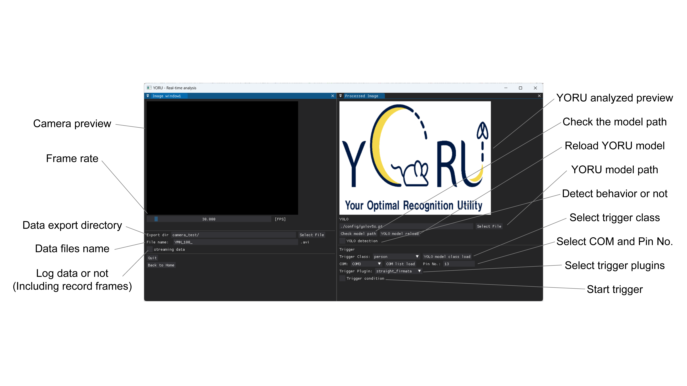

# Real-time Process (Online)

1. Edit a condition YAML file.

  > [condition YAML file template](../config/yoru_default.yaml)

   ```
  name: Experiment name
  export: Folder path for video exporting
  export_name: Name of exporting videos

  model:
   yolo_model_path: Path to YORU model
  
  capture_style:
   stream_MSS: False # If True, YORU start screen capture mode
  
  trigger:
   trigger_threshold_configuration: The threshold of detection
   trigger_class: The class of trigger
   trigger_style: Trigger plugin name
   ```

2. Select the condition YAML file in YORU start page.

3. Run "Real-time Process".

4. Operate Real-time Process GUI.




---

## Detection results (`*_detect.csv`)

One row per detection per recorded frame:

| Column | Meaning |
|---|---|
| `x1, y1, x2, y2` | the upright box, in pixels |
| `confidence` | detection score |
| `class`, `class_name` | class index and its name |
| `total_time` | seconds since the run started |
| `cx, cy, w, h` | the box's centre and its own width and height |
| `angle` | rotation of the `w` axis, in **radians** |

The last five columns describe the box as an *oriented* rectangle. A model
trained on an OBB project fills them with the rotated box it predicted and
draws a rotated rectangle on the video; any other model fills them with the
same upright box as `x1..y2` and an `angle` of `0`. The first eight columns are
unchanged from earlier versions of YORU, in both name and position, so existing
analysis scripts and trigger plugins keep working.

An OBB model needs no special setting here: leave `yolo_model_type: "auto"` and
YORU recognises it from the model itself. See
[Oriented bounding boxes](training.md#oriented-bounding-boxes).