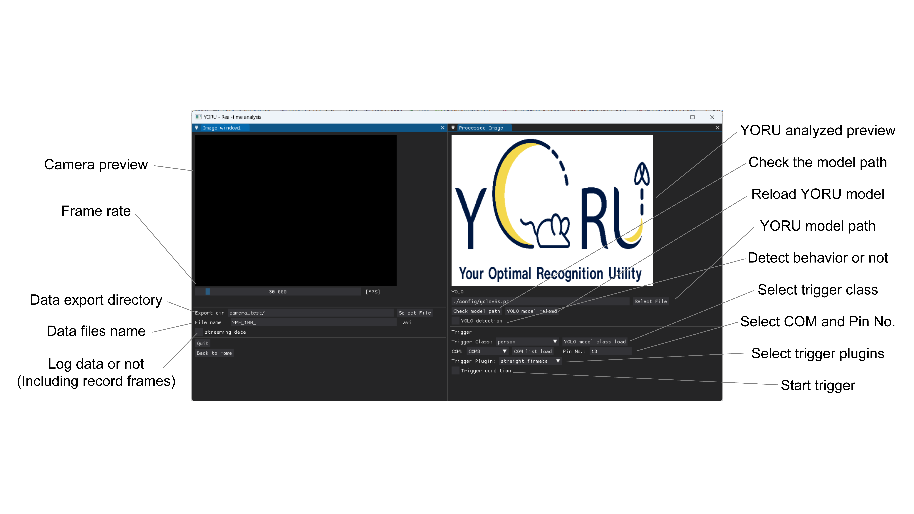

# Real-time Process (Online)

1. Edit a condition YAML file.

  > [condition YAML file template](../config/yoru_default.yaml)

   ```
  name: Experiment name
  export: Folder path for video exporting
  export_name: Name of exporting videos

  model:
   yolo_model_path: Path to YORU model
  
  capture_style:
   stream_MSS: False # If True, YORU start screen capture mode
  
  trigger:
   trigger_threshold_configuration: The threshold of detection
   trigger_class: The class of trigger
   trigger_style: Trigger plugin name
   ```

2. Select the condition YAML file in YORU start page.

3. Run "Real-time Process".

4. Operate Real-time Process GUI.




---

## Detection results (`*_detect.csv`)

One row per detection per recorded frame:

| Column | Meaning |
|---|---|
| `x1, y1, x2, y2` | the upright box, in pixels |
| `confidence` | detection score |
| `class`, `class_name` | class index and its name |
| `total_time` | seconds since the run started |
| `cx, cy, w, h` | the box's centre and its own width and height |
| `angle` | rotation of the `w` axis, in **radians** |

The last five columns describe the box as an *oriented* rectangle. A model
trained on an OBB project fills them with the rotated box it predicted and
draws a rotated rectangle on the video; any other model fills them with the
same upright box as `x1..y2` and an `angle` of `0`. The first eight columns are
unchanged from earlier versions of YORU, in both name and position, so existing
analysis scripts and trigger plugins keep working.

An OBB model needs no special setting here: leave `yolo_model_type: "auto"` and
YORU recognises it from the model itself. See
[Oriented bounding boxes](training.md#oriented-bounding-boxes).

## Stopping, recording and capture rate

Turning detection off or reloading the model invalidates its previous results.
Triggers also ignore results whose source frame is older than
`trigger.result_max_age` seconds (default `1.0`). Set this optional YAML value
to match the maximum acceptable delay for the experiment, allowing for the
model's inference time. Drawing the preview does not extend this lifetime.

Closing the window, choosing Quit, or losing the camera stops the workers.
Buffered video and CSV output is drained and closed, and the condition YAML
is copied when recording starts. A driver that does not respond to shutdown
is forcibly stopped after the shutdown grace period; this is reported as an
error because its recording may be incomplete. Trigger plugins may implement
`close()` to reset outputs and release resources; the bundled serial, display
and NI-DAQ plugins do so.

Screen capture uses `hardware.camera_fps` as its target rate and sleeps between
frames. Recording uses a bounded queue instead of reserving a 200-frame array.
If disk encoding cannot keep up, acquisition waits for space rather than
silently dropping queued frames. The AVI uses the configured constant FPS;
`*_log.csv` records the actual acquisition time for each saved frame, which is
the timing reference when capture is slower than requested. In the detection
CSV, `total_time` is the acquisition time of the frame used for inference; a
result can be reused for subsequent recorded frames until it expires.

Camera acquisition selects DirectShow on Windows, AVFoundation on macOS, or
V4L2 on Linux, with an automatic-backend fallback. The driver settings dialog
is available only on Windows. Screen regions can be dragged in any direction;
Escape cancels selection, and a zero-area click leaves selection open.
