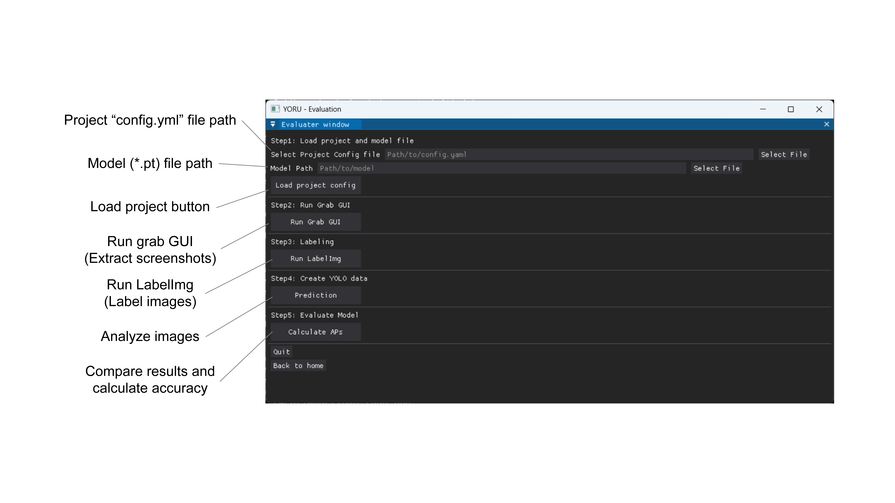

# Model evaluation

1. Run the YORU's Evaluation sub-module.

2. Load a project config.yaml file and a model.
    
    > The model is in the "exp_<model name>" folder of the project, e.g.
    > `exp_yolov5s/weights/best.pt`, `exp_yolo11s/weights/best.pt` or
    > `exp_fasterrcnn/fasterrcnn_best.pt`.
    > Training the same model again creates `exp_yolo11s2`, `exp_yolo11s3`, ...

    > A model trained with YORU v1 (`exp/weights/best.pt`) can be loaded as
    > it is: YORU recognises a YOLOv5 model by the file itself, whatever it
    > is called, and runs it with the same YOLOv5 code v1 used.

3. Extract frames for labeling using Grab GUI. 

   I. Select a video in the Video file path in the Grab GUI.

   Ⅱ. Select Save directory. (Basically, all_label_images in the project folder is a good choice.)

   Ⅲ. Decide the grabbed frame name.

   IV. Cut out the screenshot.

      i. Play video with Streaming movie.

      ii. Arrow keys to go forward and back.

      iii. Grab Current Frame or Alt key to save frame.

   > Images that are not used for creating a model are better. The Grab GUI's
   > **Automatic Extraction** can pick them for you -- set the *Video range*
   > to a part of the video the training frames did not come from. See
   > [Automatic Extraction](training.md#automatic-extraction).

4. Run LabelImg and label the frames.

    > The detailed documents are accessible in [LabelImg](https://github.com/HumanSignal/labelImg).

    > Save format is done in YOLO. 

    > It is easier to do so if Auto Save mode is turned on in the View tab.

5. Push "Prediction" button.

6. Push "Calculate APs" button. 

    > YORU calculates APs and IOUs.

## Interpreting the results

Predictions are ranked by confidence across all evaluation images. Each
ground-truth box can match only one prediction of the same class. AP uses
the all-point interpolated precision envelope at IoU thresholds 0.50 to 0.95;
classes with no ground-truth annotations have `null` AP and are excluded
from mAP. Overall precision and recall also require a box match at IoU 0.50.

For OBB models, prediction files retain all four corners and IoU measures
the intersection of the rotated polygons. Ordinary and OBB labels can be
evaluated together. Rerun **Prediction** before **Calculate APs** on an old
evaluation dataset: old `_yolo.txt` files contain only upright envelopes and
cannot recover the original rotation.

These corrected scores can differ from earlier YORU evaluations. They also
need not equal a training backend's validation score: YORU evaluates the
predictions retained by its detector's confidence/NMS settings and uses
geometric polygon IoU and all-point AP interpolation.
