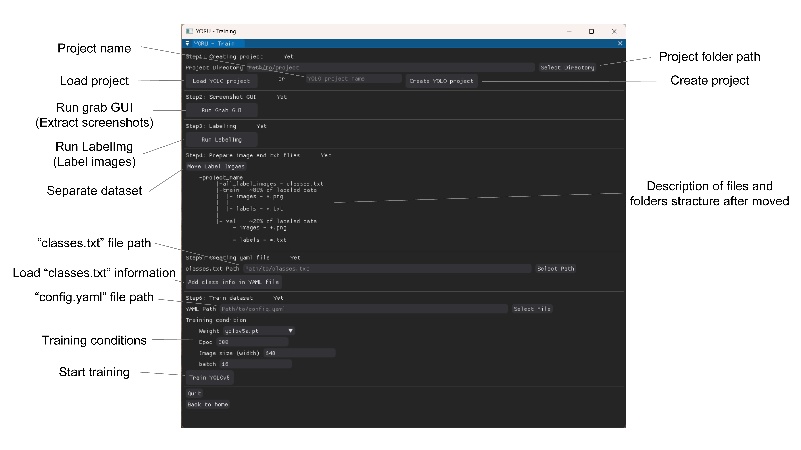
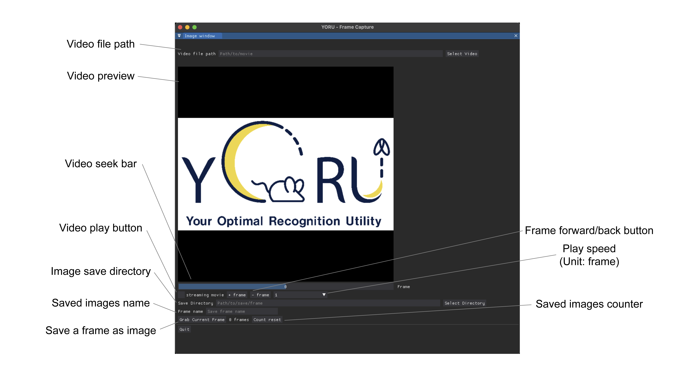

# Creating models

1. Run the YORU's Training sub-module.

2. Create a project folder. (Step0)
    
    > Folders and condition yaml file will be created.

3. Extract frames for labeling using Grab GUI. (Step1)

   I. Select a video in the Video file path in the Grab GUI.

   Ⅱ. Select Save directory. (Basically, all_label_images in the project folder is a good choice.)

   Ⅲ. Decide the grabbed frame name.

   IV. Cut out the screenshot.

      i. Play video with Streaming movie.

      ii. Arrow keys to go forward and back.

      iii. Grab Current Frame or Alt key to save frame.

4. Run LabelImg and label the frames. (Step2)

    > The detailed documents are accessible in [LabelImg](https://github.com/HumanSignal/labelImg).

    > Save format is done in YOLO. 

    > It is easier to do so if Auto Save mode is turned on in the View tab.

5. Move all images and txt files to "all_label_images" folder of the project. (Step3)

6. Push "Move Label Images" button. (Step4)

    > Images and text files are copied to the train and val folders in a 4:1 ratio.

7. Select classes.txt file and push "Add class info in YAML file". (Step5)

    > The information in classes.txt will be entered into the config.yml file.

8. Check the "YAML Path" and select training conditions, such as epochs, networks and so on.

    > The "GPU memory" line under the training conditions estimates how much
    > VRAM the run will need and compares it with what the card has free right
    > now. Green means it fits, orange means it fits with little headroom, and
    > red means the run is expected to hit a CUDA out-of-memory error.

    > The estimate is accurate to roughly ±30%, and it counts memory other
    > processes are already holding — so it drops if another training run or a
    > detection session is using the same card.

9. Start training by push "Train Model".

    >  In the terminal, you should check the initiation of training.

    > If the estimate says the run will not fit, YORU asks before starting and
    > offers the largest batch size it expects to fit.

10. To end a run early, push "Stop after this epoch".

    > Training keeps going until the epoch it is in has finished and its
    > checkpoint has been written, then ends the way a completed run does: for
    > YOLO and RT-DETR that includes the final validation pass, so `best.pt`
    > and `last.pt` in the run folder are both usable models.

    > How long this takes is one epoch at most, and the "Remaining" time is for
    > the whole run, not for the epoch. If that is still too long, "Force stop"
    > appears next to it and kills training immediately -- at the cost of the
    > epoch in progress and of the final validation.

    > The button writes an empty `.yoru_stop_request` file into the project
    > directory. A run started from a terminal can be stopped the same way by
    > creating that file by hand.

